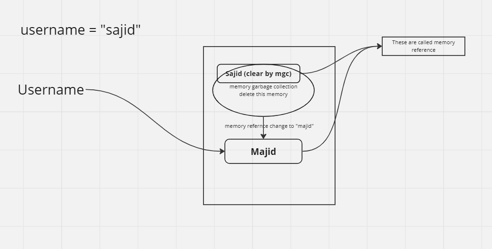
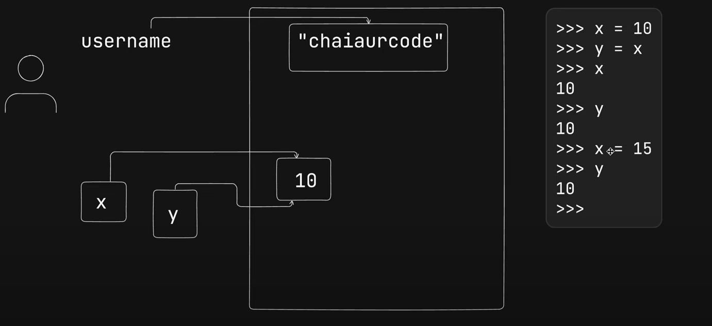
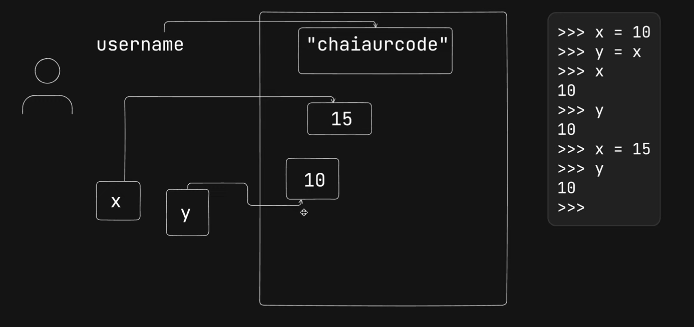

## mutable and immutable in py

# Mutable Data Types

    list
    set
    Dict
    ByteArray
    Array

# Immutable Data types

    Intergers
    Floating-point numbers
    Boolean
    Strings
    Tuples
    Frozen Set
    Bytes

# immutable string

 (It will assign in memory refercne)
and becuz python have already memory garbage collector due to which it delete previous string and assign new one

#immutable integer

while assign x value again

